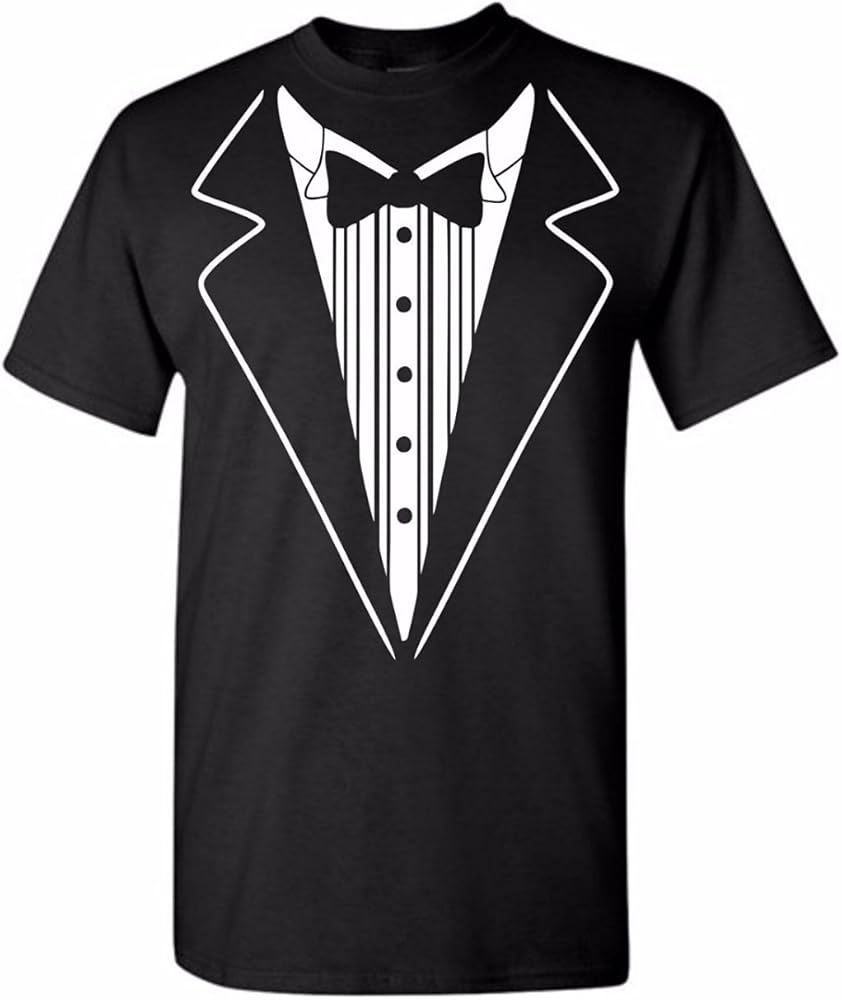

# Scene 3: Get Ready to Leave

Panicked, you jump out of bed and get ready for the day. You throw on this t-shirt:

As you bolt from the front door, something feels off. Upon investigation of your family automobile, you notice that the front left tire appears flat. You need to leave *now*, but you don't think your 1998 Toyota Camry could handle driving on three wheels.

---

What will you do?

- 🔧[Try to Pump It Back Up](./scene4A.md)
- 🤷‍♀️[Leave Anyways](./scene4B.md)